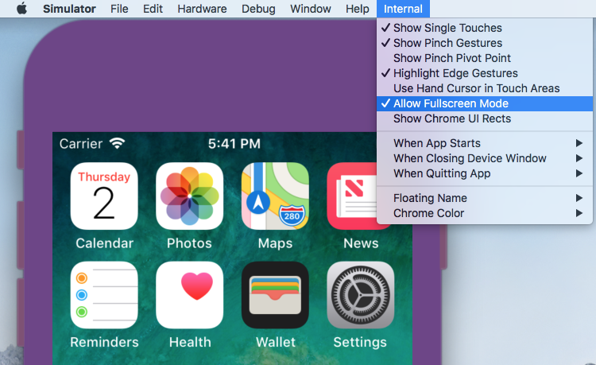

# iOS Development Tips & Tricks

## Use Simulator in full-screen mode with your IDE and more ...
If you want to explore secret features in Simulator you should enable Apple hidden Internals menu. To do so you need to create an empty folder with name “AppleInternal” in the root directory.



**sudo mkdir /AppleInternal** is no longer valid. You must use recovery mode, mount your disk and create directory. To do so:
- Click on Apple logo at the top left of the screen and select Restart.
- Immediately hold down the Command and R keys until you see an Apple logo. Eventually your Mac will show the Recovery Mode Utilities window.
- Click on Utilities in the menu bar, then click on Terminal and execute:
```shell
mount -uw /Volumes/Macintosh\ HD
cd /Volumes/Macintosh\ HD
mkdir ./AppleInternal
```

## Capture iOS Simulator video
```shell
xcrun simctl io booted recordVideo <filename>.mov
```
Press control + c to stop recording the video. The default location for the created file is the current directory.

## Remove unavailable simulators from Xcode
“Unavailable” means unavailable to **xcode-select -p** version of Xcode.
```shell
xcrun simctl delete unavailable
```
## Access Document Directory Content in Files App
From iOS 11, set following in your Info.plist so you can access your application Documents directory in the Files application.
```xml
<key>LSSupportsOpeningDocumentsInPlace</key>
<true/>
<key>UIFileSharingEnabled</key>
<true/>
```
